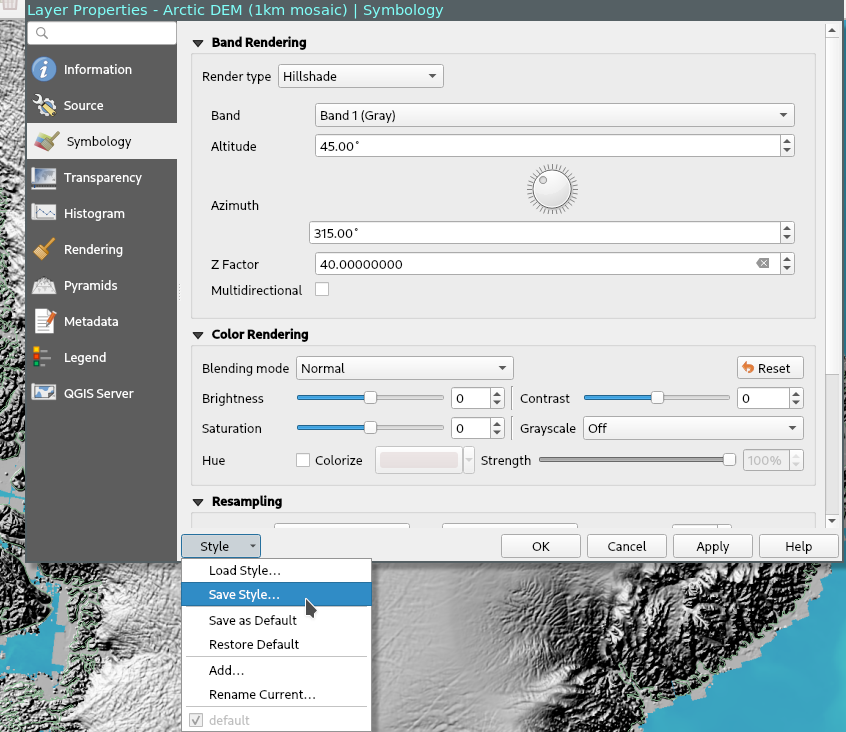
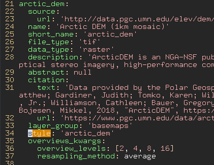

# Architecture

This project uses a `luigi` pipeline to generate the QGreenland package. Luigi
is a workflow management system developed by Spotify:
[https://github.com/spotify/luigi](https://github.com/spotify/luigi).

This project is currently undergoing rapid development, so expect change in any
release except releases labeled as "stable". Stable releases can be found at
[https://qgreenland.org/explore](https://qgreenland.org/explore)!


## NEW NEW configuration

TODO!!! Cleanup old configuration sections.


### Lockfile

Use `inv config.export > qgreenland/config/cfg-lock.json` to refresh this
lockfile.  This allows us to compare the results of configuration changes
against the previous state.


## New configuration

These are the types of configuration files available in
QGreenland:

* `config/layers/*.yml`: Layer-level metadata and the steps involved in
  building the layer from a source dataset. Try to keep related layer
  configurations together in the same file.
* `config/datasets/*.yml`: Dataset-level metadata, including how to acquire
  source dataset. Try to keep related dataset configurations together in the
  same file.
* `config/hierarchy_settings.yml`: Options for groups in the layer hierarchy.
* `config/step_templates/*.yml`: Re-usable sets of layer steps.
* `config/project.yml`: Project-level options, such as CRS.


### Layer pipeline steps

Layer pipelines are composed of steps. A step can be one of the following
types:

* `command`: Run a shell command in a conda environment (currently
  `environment.cmd.yml`).
* `python`: Run a python function with the given args/kwargs.
* `template`: Re-use a pre-written set of steps (these can also be `command`,
  `python`, or `template`). Templates can be nested!


#### Command

Run a shell command in a pre-built Conda environment. The following slugs in
your command will be string-interpolated:

* `{input_dir}`: The directory containing the previous step's output.
* `{output_dir}`: The directory in which this step will write its output.
* `{assets_dir}`: The `qgreenland/assets` directory in this repository.
* ...TBD...


#### Python

Run a python function specified with the same syntax as `python -m`, e.g.:
`package.module:function` (? I forgot.)

Python steps are located at `qgreenland/steps`. TODO: Naming and directory
structure conventions.

TODO: Define a type for a Python step function. It should always receive an
input directory and an output directory from the caller, but other args could
be anything from the YAML.


#### Template

Templates enable re-use or encapsulation of complex steps. Templates can be
nested arbitrarily deeply, so go wild.

TODO: Template naming/directory structure conventions.


## OLD configuration

There are 3 configuration files; `layers.yml` is the important one. It references
the others.


### Datasets

When adding a new layer, start by adding a new entry to `datasets.yml`.

A dataset isn't necessarily the same thing as a "dataproduct", but it might be.
A dataset is any collection of data representing some measurement, hosted
anywhere. Current access methods include:

* `cmr`: Access CMR-indexed data by `granule_ur`s.
* `http`: Access online resource by `url`s.
* `local`: Access in-repository data by `url`s. `url` is relative to
  `qgreenland/assets/local_data`.
* `manual`: Access by `access_instructions`. This data is either inaccessible
  publicly or programmatically, so instructions must be followed to seed the
  data locally.

A dataset can have many sources, each with their own id, but a layer can only
have one datasource. See the `datasource` field in `layers.yml` for more
detail.

### Layers

Each element in `layers.yml` represents a QGIS layer.

To disable a layer, comment out the whole list element for that layer in the
`layers.yml` file. This is convenient for layers with `manual` access method.

The `ingest_task` key defines which processing pipeline will handle data for
this layer. Pipelines are currently defined as Python code in
`qgreenland/tasks/layers/`. There are several other fields (typically ending in
`_kwargs` or `_args` which can be used to parameterize these pipelines.

A layer references `datasets.yml` with the `datasource` compound key composed
as `<dataset_id>.<source_id>`.

A layer references `layer_groups.yml` with the `group_path` key.


### Layer groups

Each element in `layer_groups.yml` represents a QGIS layer group in the Layers
Panel. Keep in mind that the first layer's group will always be automatically
selected and expanded.


## Pipeline

As of `v0.50.0`:

* Build layers to WIP location:
    * Coastlines
        * Fetch (HTTP)
        * Unzip
        * `ogr2ogr`
          * Reproject (EPSG:3413)
          * Subset ("background" boundary)
    * Arctic DEM
        * Fetch (HTTP)
        * Gdal Warp
          * Reproject (EPSG:3413)
          * Subset ("data" boundary)
        * Gdal Calc & Edit
          * Scale the data for more effective compression and update metadata
            to represent scaling. These tasks both have to be done to produce a
            working output.
        * Build Raster Overviews
    * IceBridge BedMachine
        * Fetch (CMR)
        * For each dataset (bed, thickness, surface):
            * Extract dataset
            * Gdal Warp
              * Reproject (EPSG:3413)
              * Resample (500m)
    * ... and many more ...

* Add ancillary files to WIP location:
  * `qgreenland.png`: QGreenland logo
  * `layer_list.csv`: Full layer list and associated information
  * `CHANGELOG.txt`: Text version of `CHANGELOG.md`
  * `CONTRIBUTING.txt`: Text version of `doc/CONTRIBUTING.md`
  * `README.txt`: Text version of `README.md`
  * `STYLE.txt`: Text version of `doc/STYLE.md`

* Generate .qgs project file:
  * Reference all layers in WIP dir
  * Reference QGreenland logo
  * Populate QGIS project metadata, e.g. copyright

* Create zip file with version in filename, e.g. `QGreenland_v0.50.0.zip`
  from data in WIP location.


# Running the project

This project uses Docker and `docker-compose` to run each of its components.
https://docs.docker.com/get-started/

The docker-compose stack runs Luigi (with visualizer at port 8082) as a service
for running tasks, as well as NGINX (port 80, 443) for hosting outputs.

In order to download data behind Earthdata Login, you must `export` the
following environment variables on the docker host:

* `EARTHDATA_USERNAME`
* `EARTHDATA_PASSWORD`

Developers at NSIDC may use the values stored in Vault at the following path:
`nsidc/apps/qgreenland`. Those outside of NSIDC must use their personal
Earthdata Login credentials. New users to Earthdata can register here:
https://urs.earthdata.nasa.gov/users/new


## Set-up for local development (required for OSX)

Create a [docker-compose
override](https://docs.docker.com/compose/extends/#understanding-multiple-compose-files)
file for `./logs` and `./appdata`.

```
ln -s docker-compose.local.yml docker-compose.override.yml
```

WARNING: Docker Desktop for OSX has some "gotchas". Running with "Use gRPC
FUSE for file sharing" _enabled_ is recommended. You may see indefinite hangs
otherwise. Please reference the Docker documentation for more info:

https://docs.docker.com/desktop/mac/


## Starting the stack locally

Ensure environment variables enumerated above are populated before starting the
stack.

```
docker-compose up -d
```

## Starting a Luigi pipeline

```
./scripts/run_task.sh
```

The `run_task.sh` script is built to run the entire pipeline. To run a subset
of layers or individual layers, comment `layers.yml` as desired.

There is also a convenience script, `scripts/dev_run_task.sh` which skips the
zip step. This saves time for development, because you will usually want to
inspect the data pre-zip.

See the [Luigi
documentation](https://luigi.readthedocs.io/en/stable/running_luigi.html) for
more information on running Luigi from the CLI if you want to do anything not
documented here.


### Debugging a Luigi pipeline

Simply put `breakpoint()` anywhere in the pipeline code, then use
`scripts/dev_run_task.sh`.


# Contributing

One of the primary goals of this project is to allow for as much control by
config as possible so data users can add layers without having to know how to
program. While we haven't achieved this goal completely, layer styles and
metadata (e.g. title, description, citation, abstract, etc.) can currently be
contributed without any programming knowledge.

You can contribute to this project even if you don't have write access by
forking, making your change, making all CI checks pass, then opening a Pull
Request. Learn more:

https://docs.github.com/en/github/collaborating-with-issues-and-pull-requests/creating-a-pull-request-from-a-fork


## Contributing styles

You can contribute style changes without editing any Python code using the
following process:

* Download (or build) and open the most recent version of the project in QGIS.
* In the 'Layers' menu, double click on the layer you wish to edit.
* Open the 'symbology' tab.
* Make your desired style changes.
* In the lower-left corner, click the 'Style' dropdown.
* In this menu, select 'Save Style...'



* At this point, if you're uncomfortable with Git and GitHub, you can email us
  your style file at qgreenland.info@gmail.com. Otherwise, continue on...
* Save the style to `qgreenland/assets/styles/<name>.qml` directory of this
  repository. Keep in mind that styles can be shared between layers, so give
  the style a generic name instead of a layer-specific name where possible.
* Edit the `qgreenland/config/layers.yml` file and find the layer(s) you wish
  to apply this style to. Populate the `style` key for each layer with the name
  of the `.qml` file you saved in the previous step, excluding the file
  extension. For example, if you saved `foo.qml`, then populate `style: 'foo'`.




## Contributing metadata

Metadata for layers and datasets can be edited in the `qgreenland/config/` YAML
files. The `datasets.yml`, for example, contains dataset-level metadata like:

```
- id: coastlines
  access_method: http
  sources:
    - id: only
      urls:
        - 'https://www.naturalearthdata.com/http//www.naturalearthdata.com/download/10m/physical/ne_10m_coastline.zip'
  metadata:
    title: 'Natural Earth Coastlines (10m)'
    abstract: 'Natural Earth Coastlines (Public Domain)'
    citation:
      text: 'Made with Natural Earth'
      url: 'https://github.com/nvkelso/natural-earth-vector/blob/master/LICENSE.md'
```

The `metadata.title`, `metadata.abstract`, and `metadata.citation` fields are
used to populate the Layer Properties / Metadata menu in QGIS.

`layer.yml` contains layer-level metadata that looks like:

```
- id: coastlines
  title: 'Coastlines'
  description: >-
    Note that the 'Greenland Coastlines' layer is preferred for Greenland.
  visible: False
  group_path: 'Basemaps'
  style: 'coastline-IHOECDIS'
  boundary: 'background'
  data_source: coastlines.only
  ingest_task: zipped_vector
  file_type: '.gpkg'
  data_type: 'vector'
```

The `data_source` key here references the dataset id `coastlines` and the
source `only` in `datasets.yml` above, allowing the QGreenland code to locate
the data for processing.

The `title` and `description` fields here are used to populate layer title and
hover text in the QGIS Layers Panel.

Some of the other keys here control layer processing and should not be modified
unless you're comfortable reading code.


## Contributing new layers

If no existing task meets your needs, create a new class in
`qgreenland/tasks/layers/<yournewpipeline>.py`, and ensure that new class is
enumerated in `qgreenland/tasks/layers/__init__.py`. Compose Luigi tasks to
build your final QGreenland layer following the example of other layer
pipelines in the same location.

We plan to expand upon this section and make the process of contributing new
layers easier in the future. In the meantime, please open a GitHub issue for
assistance or additional information. If you're not comfortable with GitHub,
you can always [email the QGreenland team](mailto:qgreenland.info@gmail.com).


### Layer Requirements

In order for a new dataset to be added to QGreenland, we strongly encourage
public archival with OGC-compliant metadata. If data is not publicly archived
or stored in a non-standard format, maintenance of that layer takes an order of
magnitude more effort and therefore we are unable to promise permanent
inclusion of such data. File formats that are particularly challenging include:
Raw binary grids, excel files, word documents. We prefer geotiffs or netcdfs
for raster data, and geopackages or shapefiles for vector data. 

A correct QGreenland data pipeline will output data that:

* Is in EPSG:3413. This is to reduce load on QGIS caused by on-the-fly
  reprojection. Some exceptions may exist in the current code as a workaround,
  but they are bugs.

* Is subset to one of the defined layer boundaries in `config/project.yml`.
  Existing layer tasks can do this for vector or raster data.

* For raster data:
  * In GeoTIFF (`.tif`) format.
  * Includes overviews, for raster data. This improves QGIS performance.
  * Is losslessly compressed using the DEFLATE algorithm.

* For vector data:
  * In GeoPackage (`.gpkg`) format.
  * Uses the `label` attribute name for pre-calculated labels when using
    generic styles with labels, for example `labeled_point.qml`


# Releasing

Use `bumpversion` to bump the specified part of the version:

```
$ bumpversion --part={major|minor|patch}
```

Versions should be in one of the following forms:

* `vX.Y.ZalphaN`: An alpha pre-release, e.g. `v1.2.3beta2`
* `vX.Y.ZbetaN`: A beta pre-release, e.g. `v1.2.3alpha2`
* `vX.Y.ZrcN`: A release candidate, e.g. `v1.2.3rc3`.
* `vX.Y.Z`: A final release, e.g. `v1.2.3`.

NOTE: When using `bumpversion build`, ensure you've already used `bumpversion
prerelease`. Running `bumpversion build` from a final release version number
can result in an incorrect patch number, e.g. `v1.2.304`.

Publishing a tag to GitHub will trigger an automated build and publish of the
QGreenland package to various mirrors.

Creating a "Release" in GitHub will trigger archival of our code in Zenodo and
issuance of a new DOI. Do _not_ create a "Release" in GitHub until a new
version of the package has been successfully built and pushed to mirrors.
