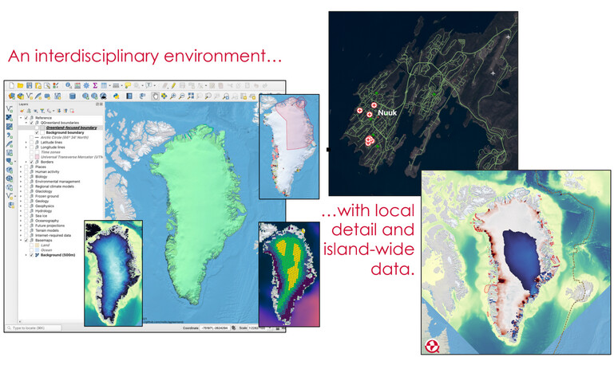

.. QGreenland documentation master file, created by
   sphinx-quickstart on Mon Dec  6 11:34:57 2021.
   You can adapt this file completely to your liking, but it should at least
   contain the root `toctree` directive.

.. toctree::
    :name: Main TOC
    :hidden:
    :maxdepth: 1

    acknowledgements.md

.. toctree::
    :name: Tutorials
    :hidden:
    :caption: Tutorials
    :maxdepth: 1
    :glob:

    tutorials/get-started.md
    tutorials/analyze-ice-sheet-volume.md

.. toctree::
    :name: How-to
    :caption: How-to
    :hidden:
    :maxdepth: 1
    :glob:

    contributor-how-to/index
    user-how-to/index

.. toctree::
    :name: Reference
    :hidden:
    :caption: Reference
    :maxdepth: 1
    :glob:

    reference/glossary/index
    reference/architecture/index
    reference/api/index
    reference/cli/index
    reference/*

.. toctree::
    :name: Discussion topics
    :hidden:
    :caption: Discussion topics
    :maxdepth: 1
    :glob:

    discussion/*

What is QGreenland?
===================

QGreenland is a free and open-source Greenland-focused GIS environment for data
analysis and viewing, powered by `QGIS <https://qgis.org>`_. QGreenland is
delivered in two ways:

1. as a large Zip package containing a core set of data curated to serve the
   majority of users; and

2. as a QGIS plugin for downloading a custom set of data, including data which
   isn't part of the Zip package (for example, due to filesize constraints).

What QGreenland *is not*
------------------------

* The QGreenland project is not a data-production project. While we do
  process existing data, it is only to enable efficient and effective viewing
  in the QGreenland QGIS environment.

* QGreenland is not a navigational aid.

Citing QGreenland
=================

We request that QGreenland be cited or acknowledged when publishing a
QGreenland-made image or map.

Citation
--------

    Moon, T., M. Fisher, L. Harden, & T. Stafford (2021). QGreenland
    (v1.0.1) [software]. Available from https://qgreenland.org.
    https://doi.org/10.5281/zenodo.4558266.

Acknowledgement
---------------

    We acknowledge the National Snow and Ice Data Center QGreenland package.
